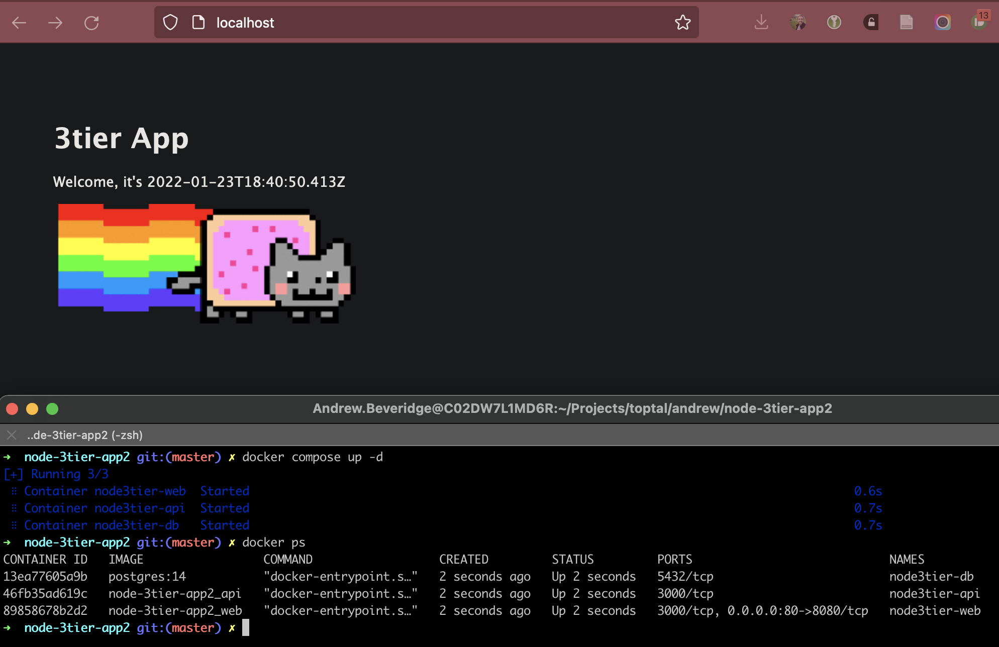

# Sample 3tier app
This repo contains code for a Node.js multi-tier application.

The application overview is as follows

```
web <=> api <=> db
```

The folders `web` and `api` respectively describe how to install and run each app.

# Local development

Both backend and frontend have a working Dockerfile.

You can run the app stack locally with the included `docker-compose.yml` config:
- docker compose up -d

Then load http://localhost in your browser, and you should see the nyan cat:


