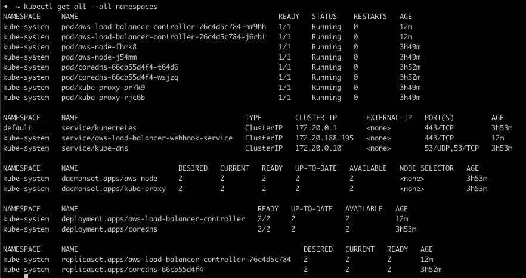

# Node 3tier App infrastructure

This directory contains [Terraform](https://www.terraform.io) config files (_Infrastructure as Code_) to provision the
production infrastructure components to run this app.

### Components provisioned:

- **AWS VPC**: Contains the remaining resources and provide separation of concerns in the AWS account
    - **Internet Gateway**: Allows internet traffic to enter into the VPC via a public IP address.
    - **Elastic IP Address**: Provisions a public IP address to route to this VPC.
    - **NAT Gateway**: Allows resources in a private subnet to connect to the Internet while rewriting the internal IP
      addresses to a single public Elastic IP for return traffic.
    - **Subnets**: As per the [EKS VPC docs](https://docs.aws.amazon.com/eks/latest/userguide/network_reqs.html), we
      create both public and private subnets so that Kubernetes can create public load balancers in the public subnets
      that load balance traffic to pods running on nodes that are in private subnets.
    - **Routing Tables, Routes & Associations**:
        - Public: All traffic from anywhere on the internet is routed to the Internet Gateway.
        - Private: Traffic from the private subnets to the internet is routed through the NAT gateway.
    - **Flow Logs**: Log all network traffic to and from the VPC; valuable for a range of security, compliance and
      investigative requirements.
        - Cloudwatch Log Group: Define a log group and retention period.
        - IAM Role & Policy: Allow flow logs to publish directly to CloudWatch Logs.

- **EKS**: Kubernetes cluster to run the application in, providing most of the capabilities listed further down.
    - **EKS Cluster IAM Role & Policies**: Allows the EKS cluster and Fargate pods to make API calls to manage AWS
      resources
    - **EKS Cluster IAM Policy CloudWatch**: Allow EKS cluster to publish metric data to CloudWatch
    - **EKS Cluster IAM Policy NLB**: Allow EKS cluster to create network load balancers and security groups
    - **CloudWatch Log Group**: Creates a place to store logs from the kubernetes cluster
    - **EKS Cluster**: Control plane for the Kubernetes cluster
    - **IAM OIDC
      provider**: [Registers](https://docs.aws.amazon.com/eks/latest/userguide/enable-iam-roles-for-service-accounts.html) the EKS cluster OpenID Connect server as a provider for AWS IAM, which allows Kubernetes service accounts to assume AWS IAM roles
    - **EKS Node Group IAM Role & Policies**: Allows EKS node kubelet daemon to make API calls to manage AWS resources
    - **EKS Node Group**: To automate the provisioning and lifecycle management of EC2 instances as Kubernetes worker
      nodes
    - **Fargate Pod Execution Role & Policy**: Allows running pods on AWS Fargate
    - **Fargate Profile**: Specifies which pods use Fargate when launched

- **Ingress**: Maps Kubernetes ingress objects to AWS Application Load Balancers (ALB), to load balance application
  traffic
    - **ALB Controller IAM Role & Policies**: Allows the controller to make AWS API calls to manage AWS resources
    - **ALB Controller Helm Chart**:
        - **Cluster Role & Service Account**: Allows the ALB Ingress Controller to manage Kubernetes resources
        - **Custom Resource Definitions (CRDs)**:
          e.g. [TargetGroupBinding](https://kubernetes-sigs.github.io/aws-load-balancer-controller/v2.3/guide/targetgroupbinding/targetgroupbinding/)
        - **Deployment**: Deploys the ALB ingress controller pods in the kube-system namespace

### Capabilities

This architecture has been designed using Kubernetes on AWS Fargate, to provide the following properties:

- Service discovery and load balancing:
    - Kubernetes can expose a container using the DNS name or using their own IP address. If traffic to a container is
      high, Kubernetes is able to load balance and distribute the network traffic so that the deployment is stable.
- Automated rollouts and rollbacks:
    - You can describe the desired state for your deployed containers using Kubernetes, and it can change the actual
      state to the desired state at a controlled rate. For example, you can automate Kubernetes to create new containers
      for your deployment, remove existing containers and adopt all their resources to the new container.
- Self-healing:
    - Kubernetes restarts containers that fail, replaces containers, kills containers that don't respond to your
      user-defined health check, and doesn't advertise them to clients until they are ready to serve.
- Secret and configuration management:
    - Kubernetes lets you store and manage sensitive information, such as passwords, OAuth tokens, and SSH keys. You can
      deploy and update secrets and application configuration without rebuilding your container images, and without
      exposing secrets in your stack configuration.

## Usage

### ⚠️ Note: First-Time Terraform State Bootstrap

If you're using terraform for the first time in a clean AWS account, or have no existing S3 bucket for terraform state,
you'll need to provision the terraform state S3 bucket and DynamoDB table before using the main module.

- Choose a globally unique name for the S3 bucket, e.g. <AWS account alias>-terraform-state
- Insert your chosen bucket name in the `terraform_state_bucket_name` variable in `remote-tfstate/variables.tf`
- Insert your chosen bucket name in the `backend "s3" -> bucket` config line in `main.tf`
- `cd remote-tfstate`
- `tf init`
- `tf apply`

If you're using this module in an AWS account which has an existing terraform state bucket and DynamoDB lock table:

- Edit the `backend "s3"` config section in `main.tf`, updating `bucket`, `region` and `dynamodb_table` values to match
  your existing state location.

## Provision

- `terraform init`
- `terraform apply`

You can then generate a `kubeconfig` file, allowing you to run kubectl commands locally against the provisioned
Kubernetes cluster:

- `aws eks update-kubeconfig --region us-east-1 --name <cluster-name>`

At this point, you should be able to list all resources in the functionally-empty cluster:
- `kubectl get all --all-namespaces`

and hopefully see something like this:

## Destroy / clean up all resources

- `terraform destroy`

If something has gone horribly wrong and Terraform is no longer tracking state correctly or is unable to delete resources, you may find [aws-nuke](https://github.com/rebuy-de/aws-nuke) helpful as a last resort!
